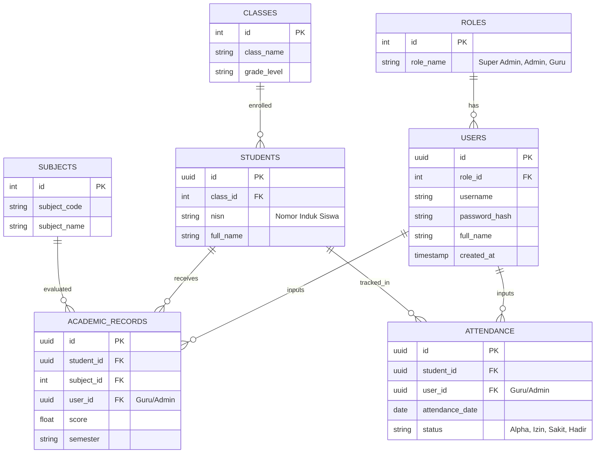

# Database Design & Strategy

## 1. Entity Relationship Diagram (ERD)

## 2. Kamus Data (Data Dictionary)

| Tabel | Kolom | Tipe Data (PostgreSQL) | Keterangan | Aturan |
|---|---|---|---|---|
| **users** | `id` | `UUID` | Primary Key | Auto-generate (gen_random_uuid()) |
| | `username` | `VARCHAR(50)` | Login identifier | UNIQUE, NOT NULL |
| | `password_hash` | `VARCHAR(255)` | Hashed password | bcrypt (NOT NULL) |
| **students** | `nisn` | `VARCHAR(20)` | Nomor Induk Siswa | UNIQUE, NOT NULL, Indexed |
| **academic_records**| `score` | `NUMERIC(5,2)` | Nilai pelajaran | Check `score >= 0 AND score <= 100` |
| **attendance**| `status` | `VARCHAR(10)` | Status kehadiran | ENUM ('Alpha', 'Izin', 'Sakit', 'Hadir') |

## 3. Migration & Rollback Strategy

### 3.1. Database Engine & Tool
- **Engine**: PostgreSQL 15+
- **Tool**: Prisma ORM, Sequelize, atau Flyway (Sesuai tumpukan Node.js)

### 3.2. Migration Strategy (Forward)
1. **Version Control**: Seluruh DDL wajib disimpan dalam folder migrations dengan urutan *timestamp* (misal: `20240101_create_users_table.sql`).
2. **Pre-Flight Check**: Migration dieksekusi terlebih dahulu di *Staging/UAT Environment*.
3. **Execution Mode**: Menggunakan *transactional migration*. Apabila 1 step gagal, keseluruhan proses akan di-*rollback* otomatis.
4. **Data Seeders**: Disediakan *seeder script* untuk tabel `ROLES` dan *Super Admin* pertama.

### 3.3. Rollback Strategy
1. **Down Script**: Setiap file *migration* (Up) wajb memiliki fungsi turunannya (Down/Drop).
2. **Snapshot / RPO 1 Jam**: Sebelum eksekusi *migration* di Production, jalankan `pg_dump` atau *snapshot* pada AWS RDS/DO Managed Database.
3. Jika *migration* gagal total:
   - Apabila belum mempengaruhi data lain, gunakan *Down Script*.
   - Apabila data korup, *restore* RDS dari *snapshot* yang diambil 5 menit sebelumnya untuk meminimalkan durasi *downtime*.
