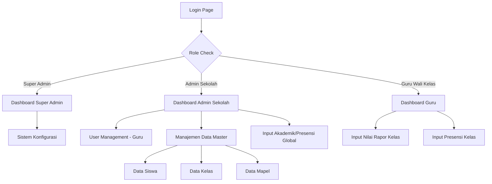
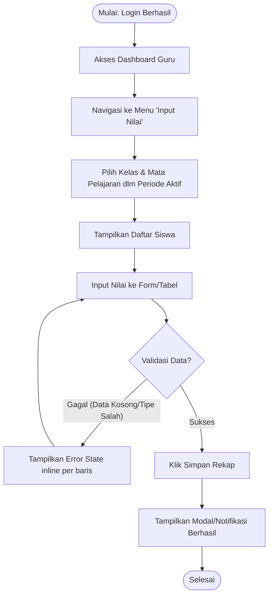

# Dokumen Fase 4A: Perancangan Antarmuka (UI/UX)

## 1. Design System (WCAG 2.1 Compliant)

**Warna (Color Palette):**
- **Primary:** `#0056b3` (Contrast ratio dengan teks putih > 7:1)
- **Secondary:** `#5c636a`
- **Success:** `#198754`
- **Warning:** `#ffc107`
- **Danger/Error:** `#dc3545`
- **Background:** `#f8f9fa`
- **Text:** `#212529`

**Tipografi:**
- **Font Family:** 'Inter', 'Roboto', sans-serif
- **Heading 1:** 24px, Bold (Untuk Judul Halaman)
- **Heading 2:** 20px, Semi-Bold (Bagian/Section)
- **Body Text:** 16px, Regular (Konten Utama, WCAG standard minimum)
- **Small Text:** 14px (Keterangan/Tooltip)

**Aksesibilitas (Accessibility Guidelines):**
- Semua form input wajib menggunakan tag `<label>` yang terhubung (melalui `id` dan `for`).
- Pesan error menggunakan warna merah (`#dc3545`) disertai dengan ikon peringatan dan teks tebal agar tidak hanya bergantung pada warna.
- Dukungan *keyboard navigation* wajib tersedia (indikator fokus visual).

---

## 2. Sitemap



---

## 3. UX Flow (Contoh: Guru Input Nilai Rapor)



---

## 4. UI/UX Wireframe (HTML + Inline CSS)

### A. Halaman Login (Dilengkapi Error State)

```html
<div style="font-family: Arial, sans-serif; background-color: #f8f9fa; min-height: 100vh; display: flex; align-items: center; justify-content: center;">
    <div style="background-color: white; padding: 2rem; border-radius: 8px; box-shadow: 0 4px 6px rgba(0,0,0,0.1); width: 100%; max-width: 400px;">
        <h1 style="color: #0056b3; font-size: 24px; margin-bottom: 1.5rem; text-align: center;">Sistem Informasi Terpadu</h1>
        
        <!-- Error State -->
        <div style="background-color: #f8d7da; color: #721c24; padding: 10px; border-radius: 4px; border: 1px solid #f5c6cb; margin-bottom: 1rem; font-size: 14px;">
            <strong>Error:</strong> Username atau Password yang Anda masukkan salah.
        </div>
        
        <form>
            <div style="margin-bottom: 1rem;">
                <label for="username" style="display: block; margin-bottom: 0.5rem; color: #212529; font-weight: bold;">Username</label>
                <input type="text" id="username" value="guru_budi" style="width: 100%; padding: 0.5rem; border: 1px solid #dc3545; border-radius: 4px; box-sizing: border-box;" aria-invalid="true">
                <span style="color: #dc3545; font-size: 12px; margin-top: 4px; display: block;">Username wajib diisi dengan format yang benar.</span>
            </div>
            
            <div style="margin-bottom: 1.5rem;">
                <label for="password" style="display: block; margin-bottom: 0.5rem; color: #212529; font-weight: bold;">Password</label>
                <input type="password" id="password" style="width: 100%; padding: 0.5rem; border: 1px solid #ced4da; border-radius: 4px; box-sizing: border-box;">
            </div>
            
            <button type="button" style="width: 100%; background-color: #0056b3; color: white; padding: 0.75rem; border: none; border-radius: 4px; font-size: 16px; font-weight: bold; cursor: pointer;">
                Login
            </button>
        </form>
    </div>
</div>
```

### B. Dashboard Input Nilai (Tabel Input Cepat)

```html
<div style="font-family: Arial, sans-serif; background-color: #f8f9fa; min-height: 100vh; padding: 2rem;">
    <div style="max-width: 1000px; margin: 0 auto; background-color: white; padding: 2rem; border-radius: 8px; box-shadow: 0 2px 4px rgba(0,0,0,0.1);">
        <h2 style="color: #212529; margin-bottom: 1.5rem;">Input Nilai Kelas X-MIPA 1 - Matematika</h2>
        
        <div style="margin-bottom: 1.5rem; display: flex; gap: 1rem;">
            <select style="padding: 0.5rem; border-radius: 4px; border: 1px solid #ced4da;">
                <option>Semester Ganjil 2026</option>
            </select>
        </div>

        <table style="width: 100%; border-collapse: collapse; margin-bottom: 1.5rem;">
            <thead>
                <tr style="background-color: #f8f9fa; border-bottom: 2px solid #dee2e6;">
                    <th style="padding: 0.75rem; text-align: left; color: #5c636a;">No</th>
                    <th style="padding: 0.75rem; text-align: left; color: #5c636a;">Nama Siswa</th>
                    <th style="padding: 0.75rem; text-align: left; color: #5c636a;">Nilai Tugas</th>
                    <th style="padding: 0.75rem; text-align: left; color: #5c636a;">Nilai UTS</th>
                    <th style="padding: 0.75rem; text-align: left; color: #5c636a;">Nilai UAS</th>
                </tr>
            </thead>
            <tbody>
                <tr style="border-bottom: 1px solid #dee2e6;">
                    <td style="padding: 0.75rem;">1</td>
                    <td style="padding: 0.75rem;">Agus Santoso</td>
                    <td style="padding: 0.75rem;"><input type="number" value="85" style="width: 60px; padding: 4px; border: 1px solid #ced4da; border-radius: 4px;"></td>
                    <td style="padding: 0.75rem;"><input type="number" value="80" style="width: 60px; padding: 4px; border: 1px solid #ced4da; border-radius: 4px;"></td>
                    <td style="padding: 0.75rem;"><input type="number" value="88" style="width: 60px; padding: 4px; border: 1px solid #ced4da; border-radius: 4px;"></td>
                </tr>
                <tr style="border-bottom: 1px solid #dee2e6;">
                    <td style="padding: 0.75rem;">2</td>
                    <td style="padding: 0.75rem;">Budi Rahayu</td>
                    <td style="padding: 0.75rem;">
                        <input type="number" style="width: 60px; padding: 4px; border: 2px solid #dc3545; border-radius: 4px; background-color: #f8d7da;">
                        <br><span style="color: #dc3545; font-size: 10px;">Nilai 0-100</span>
                    </td>
                    <td style="padding: 0.75rem;"><input type="number" style="width: 60px; padding: 4px; border: 1px solid #ced4da; border-radius: 4px;"></td>
                    <td style="padding: 0.75rem;"><input type="number" style="width: 60px; padding: 4px; border: 1px solid #ced4da; border-radius: 4px;"></td>
                </tr>
            </tbody>
        </table>
        
        <div style="display: flex; justify-content: flex-end; gap: 1rem;">
            <button style="padding: 0.5rem 1rem; border: 1px solid #ced4da; background-color: white; border-radius: 4px; cursor: pointer;">Batal</button>
            <button style="padding: 0.5rem 1rem; border: none; background-color: #0056b3; color: white; border-radius: 4px; font-weight: bold; cursor: pointer;">Simpan Data</button>
        </div>
    </div>
</div>
```
